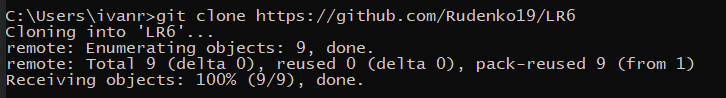
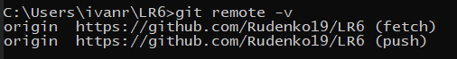
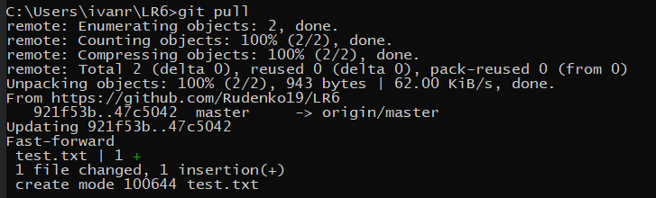
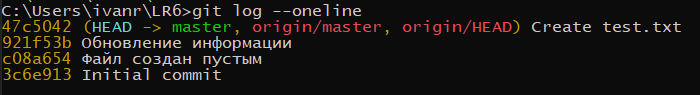
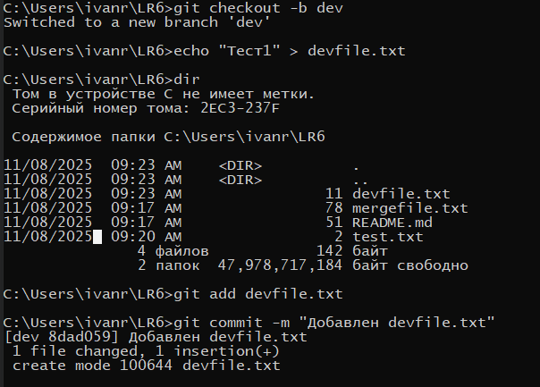
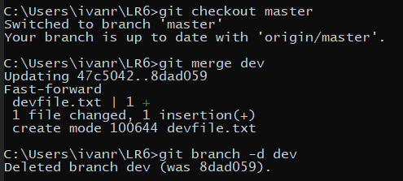
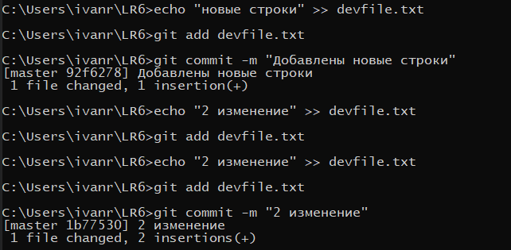
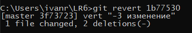
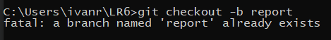
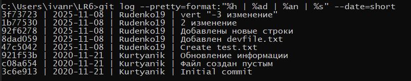

# Лабораторная работа №6
## Система контроля версий

**Студент:** 4416, Руденко И.Д.  
**Репозиторий:** https://github.com/Rudenko19/LR6  

**Цель работы:** изучение базовых возможностей Git, работа с локальным и удалённым репозиторием.

## 1. Клонирование репозитория
Команда: git clone https://github.com/Rudenko19/LR6  
Описание: клонировал удалённый репозиторий на локальный компьютер.  
Скриншот: 

## 2. Проверка удалённого репозитория
Команда: git remote -v  
Описание: проверил, какие URL настроены для fetch и push.  
Скриншот: 

## 3. Подтягивание изменений с GitHub
Команда: git pull  
Описание: подтянул изменения из удалённого репозитория (добавлен test.txt).  
Скриншот: 

## 4. Просмотр истории коммитов
Команда: git log --oneline  
Описание: просмотрел краткий лог коммитов.  
Скриншот: 

## 5. Создание ветки dev и работа в ней
Команды: 
git checkout -b dev  
echo "Тест1" > devfile.txt  
git add devfile.txt  
git commit -m "Добавлен devfile.txt"  
Описание: создал ветку dev, добавил файл и сделал коммит.  
Скриншот: 

## 6. Слияние ветки dev в master и удаление побочной ветки
Команды: 
git checkout master  
git merge dev  
git branch -d dev  
Описание: слил ветку dev в master (fast-forward) и удалил локальную ветку dev.  
Скриншот: 

## 7. Дополнительные изменения и несколько коммитов
Команды: 
echo "новые строки" >> devfile.txt  
git add devfile.txt  
git commit -m "Добавлены новые строки"  
echo "2 изменение" >> devfile.txt  
git add devfile.txt  
git commit -m "2 изменение"  
Описание: добавил дополнительные строки в файл и сделал два коммита.  
Скриншот: 

## 8. Откат (revert) последнего изменения
Команда: git revert 1b77530  
Описание: сделал git revert для отмены изменений, внесённых коммитом 1b77530.  
Скриншот: 

## 9. Создание ветки для отчёта
Команда: git checkout -b report  
Описание: переключился на ветку report для оформления README и размещения скриншотов.  
Скриншот: 

## 10. Лог команд (без вывода)
git clone https://github.com/Rudenko19/LR6  
cd LR6  
git remote -v  
git pull  
git log --oneline  
git status  
git checkout -b dev  
echo "Тест1" > devfile.txt  
git add devfile.txt  
git commit -m "Добавлен devfile.txt"  
git checkout master  
git merge dev  
git branch -d dev  
echo "новые строки" >> devfile.txt  
git add devfile.txt  
git commit -m "Добавлены новые строки"  
echo "2 изменение" >> devfile.txt  
git add devfile.txt  
git commit -m "2 изменение"  
git revert 1b77530  
git checkout -b report  
notepad README.md  
mkdir screenshots  
git add README.md screenshots/  
git commit -m "Добавлен отчёт с логами и скриншотами"  
git push origin report

## 11. История операций (сокращённый формат)
3f73723 | 2025-11-08 | Rudenko19 | vert "-3 изменение"  
1b77530 | 2025-11-08 | Rudenko19 | 2 изменение  
92f6278 | 2025-11-08 | Rudenko19 | Добавлены новые строки  
8dad059 | 2025-11-08 | Rudenko19 | Добавлен devfile.txt  
47c5042 | 2025-11-08 | Rudenko19 | Create test.txt  
921f53b | 2020-11-21 | Kurtyanik | Обновление информации  
c08a654 | 2020-11-21 | Kurtyanik | Файл создан пустым  
3c6e913 | 2020-11-21 | Kurtyanik | Initial commit
Скриншот: 

## 12. Финальная фиксация и отправка на удалённый репозиторий
git add README.md screenshots/  
git commit -m "Добавлен отчёт с логами и скриншотами"  
git push origin report

